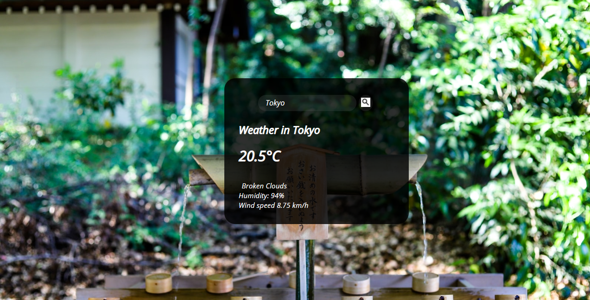

# Weather_app.

> This is part of the Weather-App Project in [The Odin Project's](https://www.theodinproject.com/courses/javascript/lessons/weather-app?ref=lnav) Javascript Curriculum.
> This App gets the weather of a particular location and also the location of the user using the app.
> A user can input the name of a city and the app retrieves the weather for that location.

[Demo Link](https://pensive-haibt-c3799b.netlify.app/)

## Built With

- Javascript (Fetch, ES6)
- HTML
- CSS

## Getting Started

To get a local copy up and running follow these simple example steps.

- Clone the repository and there you go! ;-)

### Prerequisites

- Get a browser like Chrome and Firefox in their most recent versions
- Code Editor (VSCode)

### Setup

- Open a terminal and run the command ``
- cd Weather_app
- run `npm install`
- run `npm run build`
- Open the index.html file in the dist folder with any browser of your choice.

### for webpack run:

`npm run build`

## Author

👤 **Popoola Grace Boluwatife**

- Github: [@GraceOyiza](https://github.com/GraceOyiza)
- Twitter: [@\_PopsonGrace](https://twitter.com/_PopsonGrace)
- LinkedIn: [@grace](https://www.linkedin.com/in/grace-popoola)

## 🤝 Contributing

Contributions, issues and feature requests are welcome!

Feel free to check the [issues page]("https://github.com/GraceOyiza/Weather_app/issues").

## Show your support

Give a ⭐️ if you like this project!
